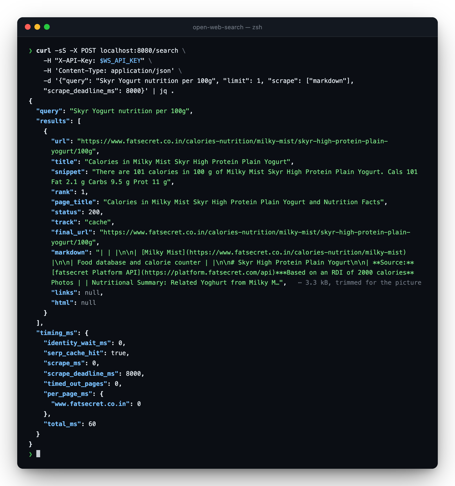

<h1 align="center">Open Web Search</h1>

<p align="center">
  <b>Self-hosted web search and scrape.</b><br>
  Real Google Chrome driving a real search engine, then fetching and cleaning the pages it found.<br>
  One VPS. No per-request billing. No vendor deciding what your traffic looks like.
</p>

<p align="center">
  <code>POST /search</code> · <code>POST /scrape</code> · <code>POST /map</code> · <code>GET /health</code><br>
  <sub>FastAPI · Playwright · real Chrome under Xvfb · SQLite cache · MIT</sub>
</p>

<br>

<p align="center">
  
</p>

<p align="center">
  <sub>One <code>/search</code> call. The ranked result, the page as clean markdown, and where the time went.<br>
  This is a warm run: 60 ms, nothing spent. Full response in <a href="#one-real-request">One real request</a>.</sub>
</p>

<br>

## Contents

| Section | What is there |
|---|---|
| [Quickstart](#quickstart) | up and answering in four commands |
| [One real request](#one-real-request) | the call in the picture, and its full response |
| [API reference](#api-reference) | every request and response field |
| [Errors](#errors) | status codes and what to do about them |
| [How it works](#how-it-works) | the pipeline one request walks |
| [Why this works at all](#why-this-works-at-all) | the measurements behind the design |
| [Identities](#identities) | the pool, and why it is the hard part |
| [Configuration](#configuration) | env vars and per-domain policy |
| [Running it](#running-it) | Docker and local |
| [Limits](#limits) | what it does not do |

<br>

## Quickstart

```bash
cp .env.example .env                                   # set WS_API_KEY
cp config/identities.example.txt config/identities.txt
docker compose up -d --build

curl -s localhost:8080/health | jq
```

Docker installs real Google Chrome for you. For a local run without Docker, see
[Running it](#running-it).

### Authentication

One key, one header. Every route except `/health` requires it:

```http
X-API-Key: YOUR_KEY
```

Set it once as `WS_API_KEY` in `.env` (`openssl rand -hex 32` makes a good one).
The service refuses to start while it is empty. A search engine anyone can call
is a search engine whose identities get burned on someone else's traffic.

There is deliberately nothing more: no per-caller keys, no rate tiers, no token
formats to choose between. Throughput is `identities ÷ cooldown`, so clients that
must not be able to starve each other get their own deployment, not their own key.

<br>

## One real request

The call in the picture, ready to paste:

```bash
curl -sS -X POST localhost:8080/search \
  -H "X-API-Key: $WS_API_KEY" \
  -H 'Content-Type: application/json' \
  -d '{
    "query": "Skyr Yogurt nutrition per 100g",
    "limit": 1,
    "scrape": ["markdown"],
    "scrape_deadline_ms": 8000
  }' | jq .
```

<details>
<summary><b>Full response</b> — every field, the whole <code>markdown</code> string, nothing trimmed</summary>

<br>

```json
{
  "query": "Skyr Yogurt nutrition per 100g",
  "results": [
    {
      "url": "https://www.fatsecret.co.in/calories-nutrition/milky-mist/skyr-high-protein-plain-yogurt/100g",
      "title": "Calories in Milky Mist Skyr High Protein Plain Yogurt",
      "snippet": "There are 101 calories in 100 g of Milky Mist Skyr High Protein Plain Yogurt. Cals 101 Fat 2.1 g Carbs 9.5 g Prot 11 g",
      "rank": 1,
      "page_title": "Calories in Milky Mist Skyr High Protein Plain Yogurt and Nutrition Facts",
      "status": 200,
      "track": "cache",
      "final_url": "https://www.fatsecret.co.in/calories-nutrition/milky-mist/skyr-high-protein-plain-yogurt/100g",
      "markdown": "| | |\n\n| [Milky Mist](https://www.fatsecret.co.in/calories-nutrition/milky-mist) |\n\n| Food database and calorie counter | |\n\n# Skyr High Protein Plain Yogurt\n\n| **Source:**[fatsecret Platform API](https://platform.fatsecret.com/api)***Based on an RDI of 2000 calories** Photos | | Nutritional Summary: Related Yoghurt from Milky Mist: More products from Milky Mist: Other types of Yoghurt: |\n\n| 5% | of RDI* (101 cal) | |\n\n| Calorie Breakdown: | |\n\n| | | |\n\n| Cals 101 | | Fat 2.1g | | Carbs 9.5g | | Prot 11g |\n\n| There are **101 calories** in 100 g of Milky Mist Skyr High Protein Plain Yogurt. |\n| Calorie Breakdown: **19% fat** , 38% carbs, 44% prot. |\n\n| [Blueberry Lassi](https://www.fatsecret.co.in/calories-nutrition/milky-mist/blueberry-lassi/100ml) | |\n| [Fruit Yoghurt Peach](https://www.fatsecret.co.in/calories-nutrition/milky-mist/fruit-yoghurt-peach/100g) | |\n| [Greek Yogurt Honey & Fig](https://www.fatsecret.co.in/calories-nutrition/milky-mist/greek-yogurt-honey-fig/100g) | |\n| [Skyr Iceland Yogurt Blueberry](https://www.fatsecret.co.in/calories-nutrition/milky-mist/skyr-iceland-yogurt-blueberry/100g) | |\n| [Curd](https://www.fatsecret.co.in/calories-nutrition/milky-mist/curd/100g) | |\n| [Fruit Yoghurt Mango](https://www.fatsecret.co.in/calories-nutrition/milky-mist/fruit-yoghurt-mango/100g) | |\n| | [**View More Milky Mist Yoghurt Products**](https://www.fatsecret.co.in/calories-nutrition/search?q=Milky+Mist+Yoghurt) |\n\n| [High Protein Low Fat Paneer](https://www.fatsecret.co.in/calories-nutrition/milky-mist/high-protein-low-fat-paneer/100g) | |\n| [Paneer](https://www.fatsecret.co.in/calories-nutrition/milky-mist/paneer/100g) | |\n| [Fresh Cream](https://www.fatsecret.co.in/calories-nutrition/milky-mist/fresh-cream/100g) | |\n| [Butter](https://www.fatsecret.co.in/calories-nutrition/milky-mist/butter/100g) | |\n| [Dahi](https://www.fatsecret.co.in/calories-nutrition/milky-mist/dahi/100g) | |\n| | **[View all Milky Mist Products](https://www.fatsecret.co.in/calories-nutrition/milky-mist)** |\n\n| [Lowfat Plain Yoghurt](https://www.fatsecret.co.in/calories-nutrition/generic/lowfat-plain-yoghurt) | |\n| [Fruit Yoghurt (Nonfat)](<https://www.fatsecret.co.in/calories-nutrition/generic/fruit-yoghurt-(nonfat)>) | |\n| [Nonfat Plain Yoghurt](https://www.fatsecret.co.in/calories-nutrition/generic/nonfat-plain-yoghurt) | |\n| [Vanilla Yoghurt (Lowfat)](<https://www.fatsecret.co.in/calories-nutrition/generic/vanilla-yoghurt-(lowfat)>) | |\n| [Plain Yoghurt (Lowfat)](<https://www.fatsecret.co.in/calories-nutrition/generic/plain-yoghurt-(lowfat)>) | |\n| [Plain Yoghurt](https://www.fatsecret.co.in/calories-nutrition/generic/plain-yoghurt) | |\n| | [**View More Yoghurt Nutritional Info**](https://www.fatsecret.co.in/calories-nutrition/food/yoghurt) |\n\n\tPlease note that some foods may not be suitable for some people and you are urged to seek the advice of a physician before beginning any weight loss effort or diet regimen. Although the information provided on this site is presented in good faith and believed to be correct, fatsecret makes no representations or warranties as to its completeness or accuracy and all information, including nutritional values, is used by you at your own risk. All trademarks, copyright and other forms of intellectual property are property of their respective owners.\n",
      "links": null,
      "html": null
    }
  ],
  "timing_ms": {
    "identity_wait_ms": 0,
    "serp_cache_hit": true,
    "scrape_ms": 0,
    "scrape_deadline_ms": 8000,
    "timed_out_pages": 0,
    "per_page_ms": {
      "www.fatsecret.co.in": 0
    },
    "total_ms": 60
  }
}
```

</details>

<br>

**It is a warm run.** `serp_cache_hit: true` and `track: "cache"` mean neither an
identity nor a fetch was spent, which is why it took 60 ms. A cold call of a new
query pays for the search itself (about 1.2 s, see [Speed](#speed)) plus one page
fetch, and comes back `track: "static"` or `track: "browser"` depending on whether
plain HTTP was enough.

**The markdown is the page, not a summary.** The table scaffolding, the "related
products" links and the site's disclaimer at the end were all in the DOM when the
page was fetched, so they are all in the string. Nothing interprets the page on
the way out. Turning that into fields is your code's job.

**The deadline is a ceiling, not a target.** `scrape_deadline_ms` bounds the whole
scrape phase. Pages still in flight when it expires come back `track: "timeout"`
with null content, and every other result in the response is unaffected.

<br>

## API reference

Base URL `http://localhost:8080`. Every body is JSON; every response is JSON.

`/search`, `/scrape` and `/map` mirror the request and response shapes of a
well-known hosted API, so existing call sites usually migrate by changing one base
URL.

<br>

### `POST /search`

Search, and optionally scrape every result in the same round trip.

#### Request

| Field | Type | Default | Notes |
|---|---|---|---|
| `query` | `string` **required** | — | What to search for. Aliases: `q`, `food_name`, `name` |
| `limit` | `int` (1–20) | `10` | Results to return |
| `scrape` | `string[]` | `[]` | `markdown` · `links` · `html`. Empty = URLs only, fastest |
| `site` | `string` | — | Restrict to one domain, e.g. `arxiv.org` |
| `brand` | `string` | — | Prepended to the query |
| `raw` | `bool` | `false` | Send `query` verbatim: no query building, no suffix |
| `lat` / `lng` | `float` | from env | Geolocation handed to the browser |
| `scrape_deadline_ms` | `int` (200–60000) | `1200` | Hard ceiling on the scrape phase |
| `scrape_top` | `int` (1–20) | all | Scrape only the first N results; the rest come back as URLs + snippets |
| `user_id` | `string` | — | Accepted for tracing; not used |

Unknown keys are **ignored**, not rejected. An existing client body works unchanged.

```json
{ "query": "webassembly component model", "limit": 3, "scrape": ["markdown"] }
```

#### Response

| Field | Type | Notes |
|---|---|---|
| `query` | `string` | The query actually sent to the engine, after building |
| `results[]` | `object[]` | In the engine's own ranking order |
| `timing_ms` | `object` | Where this request's time went |

Each entry in `results[]`:

| Field | Type | Present |
|---|---|---|
| `url` | `string` | always |
| `title` | `string` | always. The SERP title |
| `snippet` | `string` | always |
| `rank` | `int` | always. 1-based |
| `status` | `int` | only when `scrape` was requested · `0` on timeout/failure |
| `track` | `string` | `static` · `browser` · `cache` · `timeout` · `failed` |
| `final_url` | `string \| null` | after redirects |
| `page_title` | `string \| null` | `<title>` of the fetched page, not the SERP |
| `markdown` | `string \| null` | when `"markdown"` in `scrape` |
| `links` | `string[] \| null` | when `"links"` in `scrape` |
| `html` | `string \| null` | when `"html"` in `scrape` |

<details>
<summary><b>Example response</b> with a scrape and one timed-out page</summary>

<br>

```json
{
  "query": "webassembly component model",
  "results": [
    {
      "url": "https://component-model.bytecodealliance.org/",
      "title": "The WebAssembly Component Model",
      "snippet": "The component model is a broad-reaching architecture for…",
      "rank": 1,

      "status": 200,
      "track": "static",
      "final_url": "https://component-model.bytecodealliance.org/",
      "page_title": "Introduction - The Component Model",
      "markdown": "# The WebAssembly Component Model\n\nThe component model is…",
      "links": null,
      "html": null
    }
  ],
  "timing_ms": {
    "identity_wait_ms": 0,
    "serp_cache_hit": false,
    "google_ms": 1145,
    "serp_phases_ms": { "tab": 0, "commit": 175, "results": 523, "resolve": 113, "dwell|resolve": 445, "release": 0 },
    "scrape_ms": 1201,
    "scrape_deadline_ms": 1200,
    "timed_out_pages": 1,
    "per_page_ms": { "component-model.bytecodealliance.org": 412, "example.dev": 1200 },
    "total_ms": 2597
  }
}
```

</details>

<br>

**Reading `timing_ms`**

- `identity_wait_ms` is pool pressure, not search work. If it dominates, add
  identities rather than tuning code.
- `serp_phases_ms` splits the search itself. `commit` is the engine's time to first
  byte, `results` how long until enough organic results were in the DOM,
  `dwell|resolve` the jittered pause on the page overlapped with resolving the
  redirect wrappers. A large `tab` means Chrome had to be relaunched.
- `per_page_ms` is keyed by host on purpose. A slow request is almost always *one*
  slow site, and an aggregate number hides which.

**The deadline is per-request, not per-page.** Pages still in flight when
`scrape_deadline_ms` expires come back as `track: "timeout"` with `status: 0` and
null content. One slow site costs that site's result, never the whole response.

<br>

### `POST /scrape`

One URL → its content.

#### Request

| Field | Type | Default | Notes |
|---|---|---|---|
| `url` | `string` **required** | — | Must be a valid absolute URL |
| `formats` | `string[]` | `["markdown"]` | `markdown` · `links` · `html` |
| `lat` / `lng` | `float` | — | Geolocation for this fetch |
| `force_fresh` | `bool` | `false` | Bypass the page cache |

```json
{ "url": "https://example.dev/docs/intro", "formats": ["markdown", "links"] }
```

#### Response

| Field | Type | Notes |
|---|---|---|
| `url` | `string` | as requested |
| `final_url` | `string \| null` | after redirects |
| `status` | `int` | upstream HTTP status |
| `track` | `string` | `static` · `browser` · `cache`. How it was fetched |
| `title` | `string \| null` | page `<title>` |
| `markdown` | `string \| null` | when requested |
| `links` | `string[] \| null` | absolute `http(s)` hrefs, de-duplicated, in document order |
| `html` | `string \| null` | when requested |

```json
{
  "url": "https://example.dev/docs/intro",
  "final_url": "https://example.dev/docs/intro",
  "status": 200,
  "track": "static",
  "title": "Introduction",
  "markdown": "# Introduction\n\n…",
  "links": ["https://example.dev/docs/install"],
  "html": null
}
```

`track` tells you what it cost. `static` is a plain HTTP fetch (\~300 ms). `browser`
means the static fetch came back unreadable and a real Chrome rendered it (\~3 s).
`cache` means neither happened.

<br>

### `POST /map`

Enumerate a domain from its `sitemap.xml`. Plain HTTP, no browser: cheap and polite.

#### Request

| Field | Type | Default | Notes |
|---|---|---|---|
| `domain` | `string` **required** | — | Bare host, e.g. `example.dev` |
| `search` | `string` | — | Case-sensitive substring filter on the URL |
| `limit` | `int` (1–5000) | `500` | |

```json
{ "domain": "example.dev", "search": "/docs/", "limit": 500 }
```

#### Response

```json
{
  "domain": "example.dev",
  "urls": ["https://example.dev/docs/intro", "https://example.dev/docs/install"]
}
```

<br>

### `GET /health`

No authentication. Safe to point a monitor at.

<details>
<summary><b>Example response</b></summary>

<br>

```json
{
  "ok": true,
  "identity_pool": {
    "total": 3,
    "states": { "warm": 2, "leased": 0, "cooling": 1, "quarantined": 0, "retired": 0 },
    "block_rate": 0.0,
    "retired": []
  },
  "browsers": {
    "open_contexts": 1, "open_tabs": 0,
    "max_tabs_per_context": 6, "max_open": 2, "idle_ttl_s": 120
  },
  "concurrency": {
    "in_flight": 0, "queued": 0, "max_in_flight": 8, "max_queued": 32,
    "peak_in_flight": 3, "admitted": 9330, "rejected": 0,
    "coalescing": { "in_flight": 0, "executed": 5, "coalesced": 18 }
  },
  "cache": { "page_cache": 214, "serp_cache": 61 }
}
```

</details>

<br>

**What to watch:** `block_rate` and `quarantined`. Sustained blocks above \~15% is
the signal to add residential exits. A steadily rising `queued` means you need more
identities, not more code.

<br>

## Errors

Every error is `{"detail": "..."}` with a meaningful status.

| Status | Meaning | What the caller should do |
|---|---|---|
| `401` | Missing or unrecognised API key | Fix the key. Not retryable |
| `502` | The page could not be fetched (`/scrape`) | Usually the target site. Retry once |
| `503` | Overloaded: in-flight and queue are both full | Back off for `Retry-After` seconds |
| `503` | Search unavailable: no identity could get through | Retry with backoff; check `/health` |

Both `503` forms carry a **`Retry-After`** header. A refusal you can act on
immediately beats a 90-second wait that ends in a timeout.

<br>

## How it works

```
POST /search
   │
   ├─ ① serp cache ─────────────────────────────────────── hit ⇒ ~60ms
   │
   ├─ ② lease identity      warm Chrome profile + fixed fingerprint (+ optional exit)
   │
   ├─ ③ search              real Chrome, headful, under Xvfb
   │                        read the DOM the moment results land · dwell while
   │                        the redirect wrappers resolve
   │
   ├─ ④ release             cooldown 20–45s jittered · a block quarantines instead
   │
   └─ ⑤ scrape              only when `scrape` is set · all results in parallel
                            page cache → per-domain token bucket
                            → plain HTTP (~300ms) → browser only if unreadable
                            bounded by scrape_deadline_ms
```

Steps ① and ⑤ never touch an identity. That is why a repeated query costs \~60 ms and
spends nothing.

### Speed

| Case | Time |
|---|---|
| Search, new query | **\~1.2 s** warm (0.7–2.3 s measured): engine time to first byte, results landing in the DOM, a jittered dwell |
| Search, repeated | **\~30 ms** |
| Search + scrape | search + at most `scrape_deadline_ms` (1.2 s default) |
| First search after idle | +\~1.3 s for a Chrome relaunch; `WS_CONTEXT_IDLE_TTL_S` sets how often that happens |

Throughput is `identities ÷ cooldown`. Each warm identity holds a live Chrome, so
budget \~1 GB of RAM per identity and set `WS_MAX_OPEN_CONTEXTS` to match. More
identities than the browser cap makes every other request evict and relaunch a
browser, which is exactly the cost the pool exists to avoid.

<br>

## Why this works at all

Hosted search-and-scrape APIs charge per page, browse from *their* location, and
increasingly put a model between you and the page. Self-hosting used to be a losing
fight: a headless browser is blocked by every search engine almost immediately.

That changed. **Headless is a detection class, not a flag.** A screenless browser
reports different screen metrics, different WebGL, and `HeadlessChrome` in its own
user agent. Run *real* Chrome headful against a virtual display and the whole class
of signal disappears.

Measured on a plain datacenter VPS, no proxy:

| Client | Blocked |
|---|---|
| plain `curl` | 7% |
| headless Chrome | **100%** |
| real Chrome, headful under Xvfb, paced | **8.3%** |

The second surprise: on a fresh box, *every* block landed on a profile's **first**
query, while a profile that got through once went 9-for-9. The datacenter IP was
never the problem. A Chrome profile with no cookies, no consent state and no
history was. New profiles are warmed before their first search, and the cold-start
blocks disappear.

<br>

## Identities

An identity is an inseparable triple: a persistent Chrome profile, a fixed
fingerprint, and optionally one pinned proxy exit. The pairing never changes. A
profile that hops between IPs is itself a signal.

```
warm ──acquire──▶ leased ──ok──▶ cooling ──jitter──▶ warm
                     └──blocked──▶ quarantined ──5m·30m·4h──▶ warm
                                   (>40% blocked ⇒ retired)
```

> **The profile directory is production state.** Profiles accumulate cookies and
> history, and that ordinariness is much of why this works. Back up the state
> volume like a database. Losing it resets every identity to cold and suspicious.

**Two pools, deliberately.** Search and scraping use separate identity files. Two
Chrome instances cannot share a profile directory, and page fetches queued behind
the search cooldown turn an 8-second request into a two-minute one. Content sites
are paced per-domain by the rate governor instead.

**Proxies are optional.** A plain datacenter IP held at \~8% blocked in testing. Add
residential exits when the evidence says to:

- a steady block rate above \~15%,
- volume high enough that one IP looks unusual,
- a site that serves different content per country.

`scripts/proxy_trial.py` measures a provider before you commit, and reports
cold-profile blocks separately from exit quality. Charging a first-use block to the
provider is how you reject a perfectly good exit.

<br>

## Configuration

### Nothing about one market is baked in

Results come back in the **search engine's own order**; it already ranked them.
Everything else is per-domain config:

| Concern | Where |
|---|---|
| Rate limits, browser need, geo, cache TTL, robots | per domain in `config/domains.yaml` |
| Result ordering | `rank:` per domain. **Omit it** to use the engine's order |
| Locale, timezone, Accept-Language, country | `WS_LOCALE`, `WS_TIMEZONE`, `WS_ACCEPT_LANGUAGE`, `WS_DEFAULT_COUNTRY` |
| What a bare query gets expanded to | `WS_QUERY_SUFFIX`, or send `raw: true` |

The shipped `domains.yaml` names exactly one domain, and only because search
engines need slower pacing than content sites.

### Env vars worth knowing

All are prefixed `WS_`; see [`.env.example`](.env.example) for the full set.

| Var | Default | |
|---|---|---|
| `WS_API_KEY` | *(empty)* | The one key, sent as `X-API-Key`. Refuses to start without it |
| `WS_COOLDOWN_MIN_S` / `_MAX_S` | `20` / `45` | Per-identity cooldown, jittered |
| `WS_MAX_OPEN_CONTEXTS` | `2` | Live Chromes. **≥ identity count** |
| `WS_MAX_TABS_PER_CONTEXT` | `6` | Tabs are the cheap axis: \~55 ms vs \~1330 ms |
| `WS_CONTEXT_IDLE_TTL_S` | `120` | Reap an idle Chrome after this. Relaunch costs \~1.3 s on the next search; idle Chrome costs \~150 MB |
| `WS_SERP_CACHE_TTL_S` | `21600` | 6 h. A repeated query must not spend an identity |
| `WS_MAX_IN_FLIGHT` / `WS_MAX_QUEUED` | `8` / `32` | Past both, callers get `503` + `Retry-After` |
| `WS_QUERY_SUFFIX` | *(empty)* | Appended to every non-`raw` query |
| `WS_HEADLESS` | `false` | Leave it false. That is the whole trick |

<br>

## Running it

### Docker, which installs Chrome for you

```bash
cp .env.example .env                                   # set WS_API_KEY
cp config/identities.example.txt config/identities.txt
docker compose up -d --build
curl -s localhost:8080/health | jq
```

The container binds to loopback. To reach it from anywhere else, front it with a
Cloudflare Tunnel or a TLS reverse proxy; see [`deploy/README.md`](deploy/README.md).
Never open 8080 itself: the key is the only lock, and it must not cross the
network in the clear.

### Locally, with real Google Chrome installed

Chromium will not do. `channel="chrome"` is deliberate, because the bundled build
carries its own automation tells. On macOS there is a real display, so Chrome
windows genuinely open. That is the design, not a bug.

```bash
python3 -m venv venv
./venv/bin/pip install -r requirements.txt     # ./venv/bin/pip, not a bare `pip`

cp config/identities.example.txt config/identities.txt
cat > .env <<'EOF'
WS_API_KEY=local-dev-key
WS_PROFILE_ROOT=./profiles
WS_DB_PATH=./cache.db
WS_COOLDOWN_MIN_S=5
WS_COOLDOWN_MAX_S=12
EOF

./venv/bin/python main.py          # or: python -m app.main
```

`.env.example` points the profile and cache paths at `/var/lib/open-web-search`,
which is right for the container and wrong for a laptop; the block above
overrides both. The shortened cooldown is dev-only: the 20–45 s production default
makes back-to-back testing feel like it has hung. Raise it before pointing at real
proxies. A short cooldown with few identities is what burns exits.

Deployment, sizing and the proxy decision: [`deploy/README.md`](deploy/README.md).

### Tests

```bash
python -m pytest      # no network, no browser
```

The identity pool runs on a fake clock, the rate governor on a fake sleep, and
coalescing and admission control on fake work, so the suite is deterministic and
fast.

### The screenshot

`docs/demo.png` is rendered from a live response, not pasted from a terminal:

```bash
set -a && . ./.env && set +a
./venv/bin/python scripts/render_demo.py
```

<br>

## Limits

- **Scraping search results is against major search engines' terms.** This
  automates a browser; `respect_robots` is per domain so the choice is explicit and
  yours. You are responsible for how you operate it.
- Sustained throughput needs identities, and identities need RAM. One box is not a
  crawl farm.
- \~8% of searches are blocked and retried on another identity. That is the normal
  operating point, not a bug to chase to zero.
- It returns pages, not answers. Turning a page into structured data is your
  code's job. `/search` with `scrape: ["markdown"]` gives you clean text to work
  from.

<br>

MIT licensed. See [LICENSE](LICENSE) for fixture provenance and usage notes.
